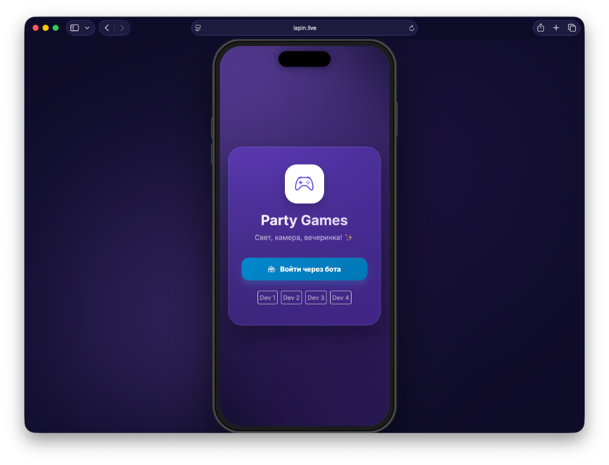
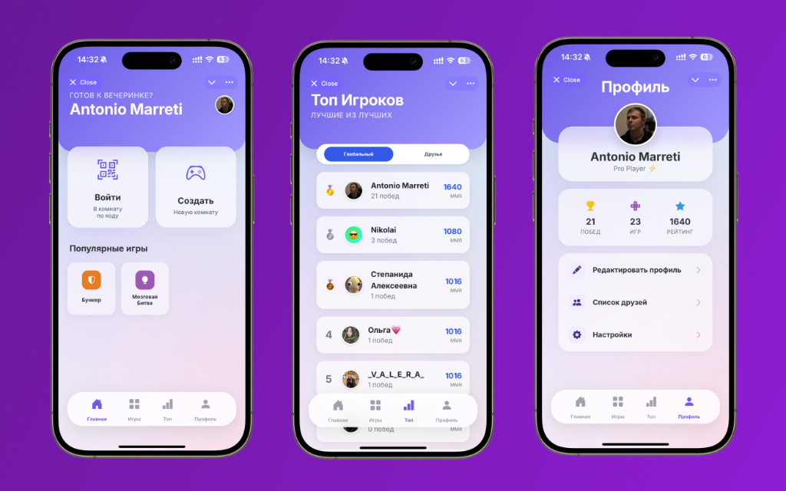

# Party Games 🎮

Платформа для мультиплеерных игр в реальном времени, созданная как Telegram Mini App.

### 🎮 Играть сейчас: [lapin.live/mpg](https://lapin.live/mpg/)

## Возможности
- 🚀 **Real-time геймплей**: Мгновенное взаимодействие между игроками.
- 📱 **Интеграция с Telegram**: Бесшовный вход и авторизация через Telegram Web App.
- 🎨 **Современный UI**: Плавные анимации, глассморфизм (glassmorphism) и mobile-first дизайн.
- 👥 **Социальность**: Система друзей, пригласительные ссылки и вход по QR-коду.
- 🏆 **Таблицы лидеров**: Глобальные и дружеские рейтинги.

<details>
  <summary><b>📸 Скриншоты интерфейса (Нажмите чтобы открыть)</b></summary>
  <br>
  <p align="center">
    <b>Desktop Версия</b><br>
    
    <br><br>
    <b>Mobile Версия</b><br>
    
  </p>
</details>

## Доступные игры 🎲
- **Бункер**: Игра-дискуссия о выживании (Beta Testing 🧪).
- **Мозговая Битва**: Викторина на скорость и эрудицию.
- **Кто из нас?**: Веселые вопросы о компании друзей.
- **Blokus**: Стратегическая настольная игра для 4 игроков.
- **Битва Слов**: Соревновательная игра в слова на скорость (Wordle Arcade).

## Технологический стек
- **Frontend**: HTML5, Vanilla JS (Transitioning to ES Modules), Bootstrap 5.
- **Backend**: PHP 8.0+, MySQL (PDO).
- **Связь**: Polling/Fetch API.

## Установка

### Требования
- Веб-сервер (Apache/Nginx) с PHP 8.0+
- База данных MySQL
- SSL сертификат (Обязательно для Telegram Web Apps)

### Настройка
1. **Клонируйте репозиторий**
   ```bash
   git clone https://github.com/AntonioMarreti/party-games.git
   cd party-games
   ```

2. **Настройка базы данных**
   - Импортируйте схему БД (см. `server/migrate.php` или запросите дамп).
   - Скопируйте `server/config.example.php` в `server/config.php`.
   - Укажите данные от базы и токен бота.

   ```bash
   cp server/config.example.php server/config.php
   nano server/config.php
   ```

3. **Telegram-бот**
   - Создайте бота через [@BotFather](https://t.me/BotFather).
   - Настройте кнопку "Menu Button" на запуск вашего Web App.
   - Добавьте токен бота в `server/config.php`.

4. **Запуск**
   - Откройте URL вашего сайта в браузере или через Telegram.

## Структура проекта
- `/css`: Стили (модульная структура).
- `/js`: Игровая логика.
  - `/modules`: ES Modules (новые компоненты).
  - `/games`: Логика конкретных игр.
- `/server`: PHP API эндпоинты.
- `/assets`: Промо-изображения и статика.
- `/sounds`: Аудио-эффекты и музыка.
- `/libs`: Сторонние библиотеки.
- `/docs`: Документация.

## 🗺️ Roadmap (Планы на будущее)

<details>
  <summary><b>🚀 Roadmap (Нажми чтобы развернуть)</b></summary>
  <br>
  
  <h4>✅ v1.2 Vibe Update (Released)</h4>
  <ul>
    <li>Внедрение Ачивок и Профилей.</li>
    <li><b>Аватар Эдитор</b>: Рисование с поддержкой Apple Pencil, загрузка фото, эмодзи.</li>
    <li><b>Zoom Аватарок</b>: Просмотр аватаров в полном размере.</li>
    <li>Добавление Ботов (AI Player framework).</li>
  </ul>

  ## 🔮 Планы по AI (Roadmap)
  Мы активно работаем над расширением возможностей ИИ:

  - **AI Оппоненты**: Умные боты с разными характерами, которые могут играть и общаться.
  - **Динамический контент**: Бесконечные сценарии для *Бункера* и объяснения слов для *WordClash*.
  - **Модерация**: Авто-бан за токсичное поведение и фильтр мата.
  - **Анализ игры**: Послематчевые разборы от ИИ (смешные или серьезные).
  - **Голосовые функции**: Озвучка событий (например, катастроф в Бункере) и TTS для вопросов.

  ## 🤝 Как помочь проекту
  <h4>🚧 v1.3 Content & Stability (Current Work)</h4>
  <p><i>Фокус: Игры, UI и Рефакторинг</i></p>
  <ul>
    <li><b>Part 1: Games Expansion</b>
      <ul>
        <li>☢️ <b>Бункер (Bunker)</b>: Завершение бета-теста. Генерация персонажей и катастроф.</li>
        <li>🐸 <b>MemeBattle</b>: Интеграция Klipy API и голосования.</li>
        <li>🕵️ <b>CodeNames</b>: В ближайших планах.</li>
        <li>✅ <b>Крестики-Нолики (Classic)</b>: Простая версия 3x3.</li>
        <li>✅ <b>Крестики-Нолики (Ultimate)</b>: Стратегическая версия 9x9.</li>
      </ul>
    </li>
    <li><b>Part 2: UI Improvement</b>
      <ul>
        <li>🌑 <b>Dark Mode</b>: Полная адаптация всех экранов.</li>
        <li>✨ <b>Glassmorphism 2.0</b>: Полировка визуального стиля.</li>
      </ul>
    </li>
    <li><b>Part 3: Refactoring</b>
      <ul>
        <li>✂️ <b>Модульность</b>: Разделение `app.js` на ES Modules.</li>
        <li>🚀 <b>Оптимизация</b>: Чистка кода и ускорение загрузки.</li>
      </ul>
    </li>
  </ul>

  <h4>🔮 v1.4 Meta-Game & Social (Planned Q3 2026)</h4>
  <p><i>Фокус: Геймификация и Сообщество</i></p>
  <ul>
    <li><b>XP System & Leagues</b>: Опыт за каждую активность, сезонные ранги (Бронза → Глобал).</li>
    <li><b>Social Features</b>:
      <ul>
        <li>Реакции эмодзи прямо в игре.</li>
        <li>Быстрый чат ("GG", "Рестарт").</li>
        <li>Профили героев с детальной статистикой.</li>
      </ul>
    </li>
    <li><b>AI Host</b>: Бот-ведущий, комментирующий ход игры.</li>
  </ul>

  <h4>🎲 Future Game Concepts (Backlog)</h4>
  <p><i>Идеи для следующих обновлений:</i></p>
  <ul>
    <li>🃏 <b>NeUno</b>: Карточная игра с "Хаос-картами".</li>
    <li>🎭 <b>Mafia</b>: Auto-Moderated режим без ведущего.</li>
    <li>🕵️ <b>Spyfall</b>: Разговорная дедукция с AI.</li>
    <li>🎨 <b>Draw & Guess</b>: Рисование на холсте поверх фото.</li>
  </ul>

  <h4>🔭 v2.0 Technical Era (Future)</h4>
  <p><i>Фокус: Смена фундамента</i></p>
  <ul>
    <li>⚡ <b>WebSockets</b>: Переход на Ratchet для мгновенного отклика (< 50ms).</li>
    <li>📱 <b>PWA</b>: Оффлайн режим, установка на экран, локальный мультиплеер (Dino Runner).</li>
    <li>📺 <b>TV Mode</b>: Оркестрация (ТВ как экран, телефоны как джойстики).</li>
  </ul>
</details>

## Лицензия
MIT License. Copyright (c) 2026 AntonioMarreti.
См. файл [LICENSE](LICENSE) для подробностей.
